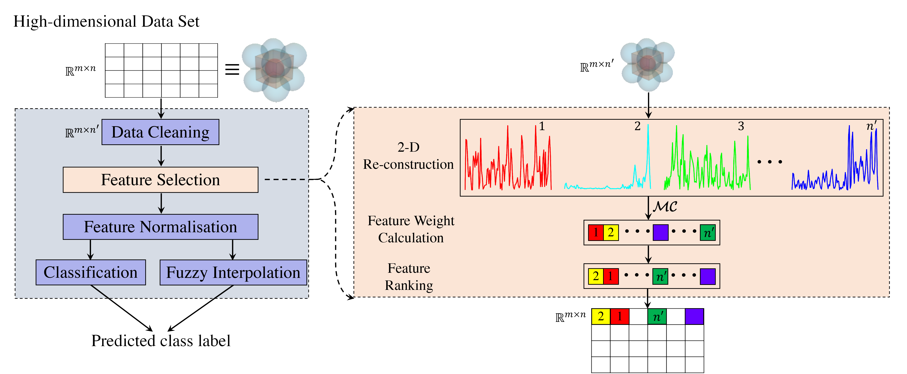

[](https://hits.seeyoufarm.com)

# **Curvature-based Feature Selection with Application in Classifying Electronic Health Records**
By [Zheming Zuo](https://scholar.google.co.uk/citations?user=jzpjf4UAAAAJ&hl=en)<sup>1,&#42;</sup>, [Jie Li](https://scholar.google.co.uk/citations?user=qiP4qZMAAAAJ&hl=en)<sup>2,&#42;</sup>, Han Xu<sup>3,4</sup>, and [Noura Al Moubayed](https://scholar.google.co.uk/citations?user=GHecv14AAAAJ&hl=en)<sup>1,&dagger;</sup><br/>
<sup>1</sup> Department of Computer Science, Durham University, Durham DH1 3LE, UK<br/>
<sup>2</sup> School of Computing, Engineering \& Digital Technologies, Teesside University, Middlesbrough TS3 6DR, UK<br/>
<sup>3</sup> Institute of Microelectronics, Chinese Academy of Sciences, Beijing 100029, China<br/>
<sup>4</sup> University of Chinese Academy of Sciences, Beijing 100049, China<br/>
<sup>&#42;</sup> Equal contribution.<br/>
<sup>&dagger;</sup> Corresponding author.

## _Introduction_
This is an official implementation of our Curvature-based Feature Selection (CFS) method.

CFS is a simple yet efficient feature selection method, which perfroms based on the Menger curvature and contributes the classification performance.



For more details, please refer our [paper](https://arxiv.org/pdf/2101.03581v2.pdf).

## _Contents_
1. [Requirement](#requirement)
2. [Preparation](#preparation)
3. [Run](#run)
4. [Performance](#performance)

### _Requirement_
- MATLAB >= 2016a

### _Preparation_
Clone the github repository. We will call the directory `$CFS_ROOT`
```Shell
  git https://github.com/zhemingzuo/CFS
  cd $CFS_ROOT
```
### _Run_
Run our CFS method
```Shell
  cd $CFS_ROOT/src
```
and then run `demo_CFS.m`.

### _Performance_
For performance comparisons that might be used in your ongoing research work, we list the peak performance of CFS on four healthcare datasets: 

- [Cervical Cancer (Risk Factors) Data Set (CCRFDS)](https://archive.ics.uci.edu/ml/datasets/Cervical+cancer+%28Risk+Factors%29)
- [Breast Cancer Coimbra Data Set (BCCDS)](https://archive.ics.uci.edu/ml/datasets/Breast+Cancer+Coimbra)
- [Breast Tissue Data Set (BTDS)](https://archive.ics.uci.edu/ml/datasets/Breast+Tissue)
- [Diabetic Retinopathy Debrecen Data Set (DRDDS)](https://archive.ics.uci.edu/ml/datasets/Diabetic+Retinopathy+Debrecen+Data+Set).

| Data Set | Method     | Original Feat. Dim.| Selected Feat. Dim. | Top Mean Acc. (%) |
| :---     | :---       | :---               | :---                | :---              |  
| CCRFDS   | CFS-TSK+   | 9                  | 7                   | 97.09             |
| BCCDS    | CFS-TSK+   | 9                  | 7                   | 79.17             |
| BTDS     | CFS-...    | 9                  | 7                   | 100.00            |
| DRDDS    | CFS-BPNN   | 19                 | 15                  | 74.72             |
> ... denotes that our CFS can be combined with multiple supervised classifiers to achieve the same classification performance.

## _Citation_
If you find CFS useful in your research, please consider citing:
```
@article{zuo2021cfs,
	title = {Curvature-based Feature Selection with Application in Classifying Electronic Health Records},
	author = {Z. Zuo and J. Li and H. Xu and N. A. Moubayed},
	journal = {arXiv preprint arXiv:2101.03581},
	year = {2021}
}
```